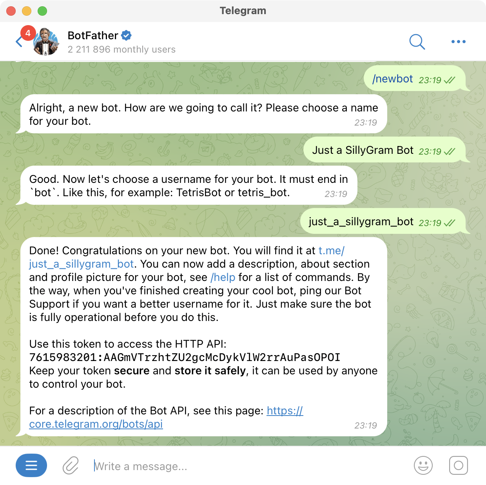
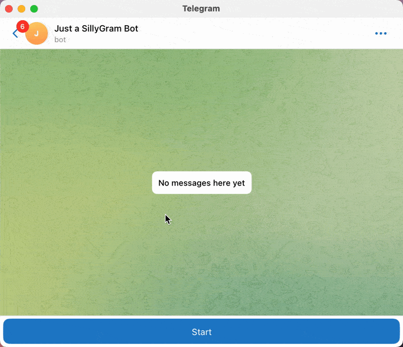
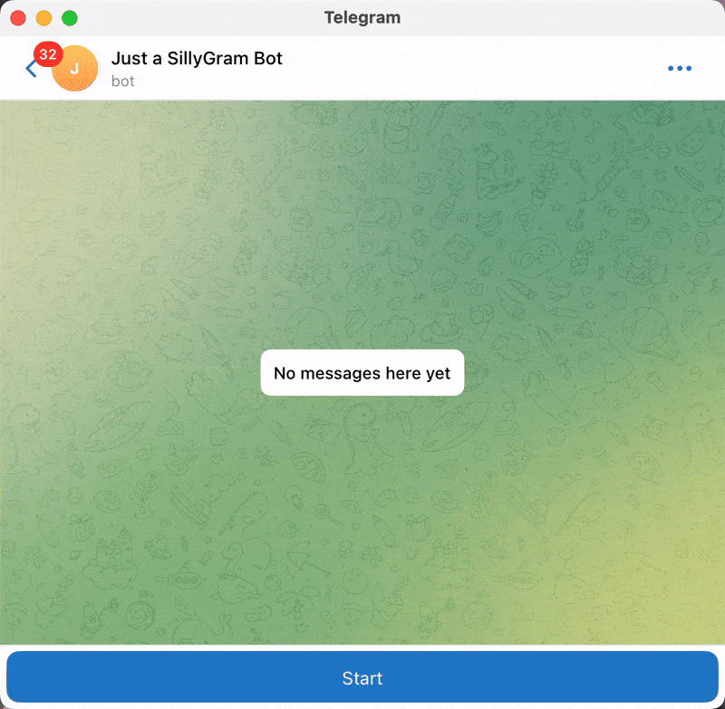
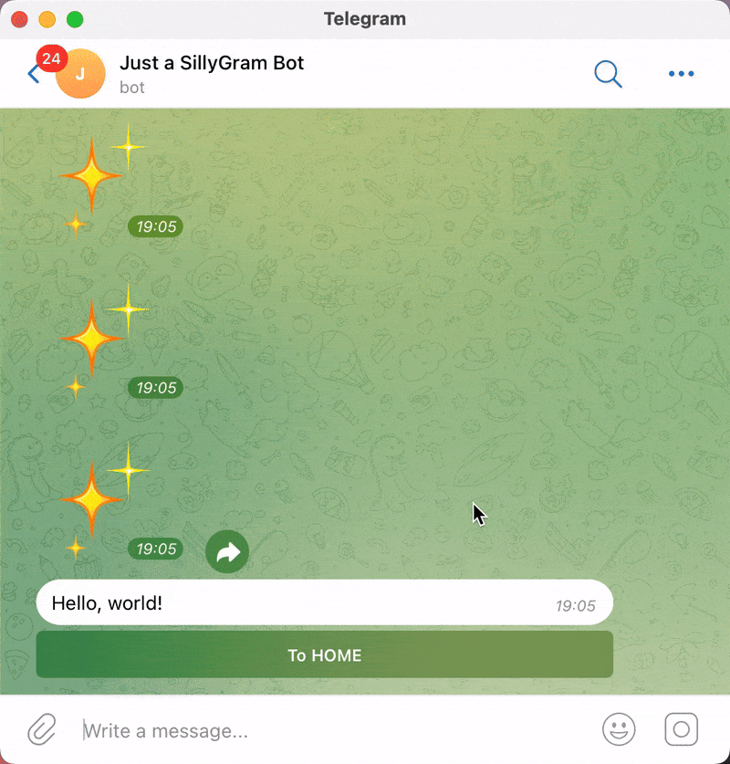
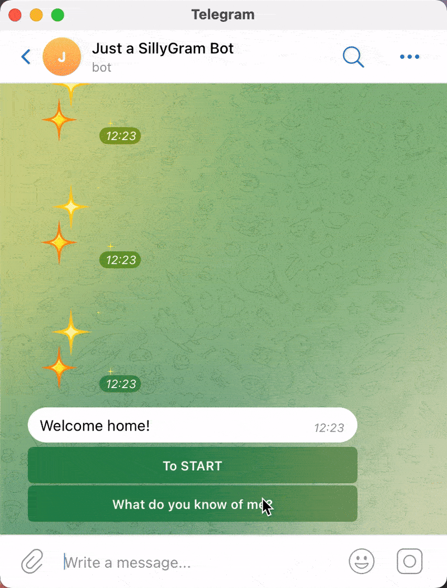

# **What is SillyGram?**

SillyGram is a lightweight Python framework for building Telegram bots, built on top of aiogram.

Telegram bots often function similarly to simple GUI applications. While creating such bots isn’t inherently difficult, it typically involves writing a significant amount of repetitive code, which can distract you from focusing on the core business logic.

SillyGram aims to streamline the development process by enabling developers to design bots at a higher level of abstraction.

With SillyGram, you can create bots as a collection of pages and buttons, without worrying about the underlying low-level chat functionalities.

# **Installation**

SillyGram can be easily installed with the help of PIP.

```bash
pip install sillygram
```

# **Quick start**

Let's create a simple Telegram-bot with the help of SillyGram. Once you have created your project and installed SillyGram library, there is still something to do before we start coding.

First of all create a bot with the help of Telegram @BotFather. After you launched it with the /start command, create your own bot following the example below.



Your new bot is now created. Moreover, there's an API-token in @BotFather's message. This token is neccessary for our future program to communicate with Telegram API and run the bot.

**Note that when it comes to publishing your app, API-tokens must be kept in secret!**

However, if a leak happened, you are always able to deactivate the token by creating a new one with the help of @BotFather.

It is now the time to start coding! Create a __main.py__ file and write these lines, replacing the template string with your API-token:

```py
from sillygram import SillyBot

bot = SillyBot(token="YOUR_API_TOKEN")
bot.launch()
```
This is the simplest SillyGram code possible We only create a SillyBot object, pass the API-token and it is enough to launch the bot. If everything is done right, the bot will truly start. However, it is now capable of practically nothing as it doesn't contain any pages. You will even get some warnings in console:

```bash
2025-01-19 13:38:04,405 - [WARNING] - _setup_specials - There must be a START page.
2025-01-19 13:38:04,406 - [WARNING] - _setup_specials - There must be a HOME page.
```

To make sure that your bot is really working, open it in Telegram and try pressing the "START" button. You will see that a command is sent, and if the SillyGram bot is running properly, you will see a notice. 



(Note that the message with the /start command is deleted. This is a SillyGram design feature for keeping the chat clean and rid of rubbish messages)

You’ve probably realized by now that we need to create START and HOME pages. But what exactly is a page?

A SillyGram bot is made of several "SillyPages" that are related to each other. This is pretty much what many mobile apps look like. A SillyPage is composed of two parts: a message with a certain text and a set of buttons ("SillyButtons") below. SillyButtons respond to user actions by performing specific tasks or navigating to other pages.

Your bot may have as many pages as you want, but it must include pages labeled as START and HOME. This pages will be called when users start interaction with the bot by using __/start__ and __/home__ commands. SillyGram is designed to operate with minimal commands — these two are the only ones available for user interaction. Without START and HOME pages, users won’t have a way to begin interacting with your bot.

Let's finally create our pages. Add some more imports to __main.py__

```python
from sillygram import SillyBot, SillyPage, SillyText
```

We already know what a SillyPage is, but what is a SillyText?

<!-- (SillyButton is an abstract type and SillyActionButton is its main implementation. There are a few more, but we'll speak of them later.) -->

Sometimes SillyGram objects and methods will require a SillyText in places where you would expect a string to be needed. And you will be right to think so – because SillyText is a wrapper for strings that allows them to be localized for different languages based on current locale of the user. It may look like this:

```py
text = SillyText({
    "en": "Hello, world!"
    "ru": "Привет, мир!"
})
```
The first key-value pair you specified will be considered default and used if user's language code is not present in the dictionary you passed. 

Moreover, you may use several language codes in a single key. This may be useful if you deal with languages that are very much alike, e.g. romanian and moldavian:

```py
text = SillyText({
    "en": "Hello, world!"
    ("ro", "mo"): "Salut Lume!"
})
```
Of cource, localization is not often neccessary, and in this case you may initialize SillyTexts with singular strings:

```py
text = SillyText("Hello, world!")
```

With this knowledge in hand, we can finally create our pages:

```py
from sillygram import SillyBot, SillyPage, SillyText

start_page = SillyPage("Start", SillyText("Hello, world!"))
home_page = SillyPage("Home", SillyText("Welcome home!"))

bot = SillyBot(
    token="YOUR_API_TOKEN",
    pages=(start_page, home_page),
)
bot.launch()
```

Note than page names are passed as plain string instead of SillyText, because these will be only used internally in program and never displayed to users. There's no need for them to be localized.

Now you can launch your bot and... see, that nothing changed. You still have the same warnings, and if you press the START button in Telegram you will still have the same 'Page not found' message. Why so?

That's simple. In the code it is never mentioned that these exact pages should be used as START and HOME. Their string names mean nothing and do not define the status of the page. For each of the page we need to set up a special flag that will mark their status.

```py
start_page = SillyPage("Start", SillyText("Hello, world!"), flags=SillyPage.Flags.START)

home_page = SillyPage("Home", SillyText("Welcome home!"), flags=SillyPage.Flags.HOME)
```
By the way, the same page may be labeled as both START and HOME with the help of | operator:

```py
SillyPage.Flags.START | SillyPage.Flags.HOME
```

Now we launch the bot again, and finally there are no warnings and the bot responds to our /start command by showing us the page we created!



To be honest, such a page is not very useful... And we are only able to see the START page. How do we visit the HOME page?

Of cource, we can use /home command, but that is not what this command is for. Moreover, this won't work for any other pages we add, because these wouldn't have individual commands.

Both /start and /home commands are not made for simple navigation. It is more of a reset of the current user position by sending a new target message and returning to the root page of the bot. This is highlighted by sparkling emojis messages that are send when commands are executed.

So, to navigate between pages and create other functionaly there are SillyButtons! That is to say, three kinds of them. Let's import and try to use them all:

```py
from sillygram import SillyNavigationButton, SillyActionButton, SillyLinkButton
```

A SillyNavigationButton is the thing we need to navigate between pages. Let's add such a button to both of our pages so that we could switch between them:

```py
start_page = SillyPage(
    name="Start",
    text=SillyText("Hello, world!"),
    flags=SillyPage.Flags.START,
    buttons=[SillyNavigationButton(SillyText("To HOME"), "Home")],
)

home_page = SillyPage(
    name="Home",
    text=SillyText("Welcome home!"),
    flags=SillyPage.Flags.HOME,
    buttons=[SillyNavigationButton(SillyText("To START"), "Home")],
)
```

Yikes, it works!



But still not very functional, to be honest... We should teach our bot to do something more impressive.

How about making the bot telling you some information about from your user profile? To do so, we have to add a SillyActionButton to our HOME page. In comparison to SillyNavigationButtons, when clicked SillyActionButtons are capable of executing your code directly. This code needs to be written in a form of an *asyncronous* function with pre-defined arguments:

```py
async def button_clicked_handler(manager, event):
    # Your code here...
```

And then this function must be passed to a SillyActionButton:

```py
button = SillyActionButton(text="Click me!", on_click=button_clicked_handler)
```

But what are those *manager* and *event* args? 

*event* (SillyEvent) object contains some info about the action that is being handled. The main thing we need is the info about the user – which is represented by a SillyUser object inside the event object (*event.user*).

A SillyUser object contains different information about current user profile, such as:

1. Telegram ID
1. Username (if exists)
1. First and second names (if exist)
1. SillyGram privelege status
1. Language code
1. Dates of the first and the latest visits to the bot

And if we can extract this info about the users, we can display it!

That's where we need the *manager* (SillyManager). Such objects are passed by SillyBot to every action handlers and contain all the methods neccessary to perform actions with the bot. For example, with the help of SillyManager we can show a pop-up message in response to a button click. Pop-ups temporarely overlap the current page content with some text content until they are closed by users.

So, when a button is clicked – its *on_click* is called. If we want the button to display some information when it is clicked, we should display it as a pop-up with the help of SillyManager inside the *on_click* function.

```py
async def on_click(manager, event):
    text = SillyText(
        f"ID: {event.user.id}"
        + f"\nUsername: {event.user.nickname}"
        + f"\nFirst name: {event.user.first_name }"
        + f"\nSecond name: {event.user.last_name}"
        + f"\nLanguage code: {event.user.language_code}"
        + f"\nRegistered at: {event.user.registration_date}"
    )

    await manager.show_popup(
        event.user, text
    )


home_page = SillyPage(
    name="Home",
    text=SillyText("Welcome home!"),
    flags=SillyPage.Flags.HOME,
    buttons=[
        SillyNavigationButton(text=SillyText("To START"), page_name="Start"),
        SillyActionButton(text=SillyText("What do you know of me?"), on_click=on_click),
    ],
)
```



But what if you want to gather some more information about the user? For example, you might want to know user's age and gender. 

Let's add according buttons to the START page:

```py

async def on_enter_age_button_clicked(manager, event):
    ...

async def on_enter_gender_button_clicked(manager, event):
    ...

start_page = SillyPage(
    name="Start",
    text=SillyText("Hello, world!"),
    flags=SillyPage.Flags.START,
    buttons=[
        [
            SillyActionButton(
                text=SillyText("Enter age"), on_click=on_enter_age_button_clicked
            ),
            SillyActionButton(
                text=SillyText("Enter gender"), on_click=on_enter_gender_button_clicked
            ),
        ],
        [SillyNavigationButton(text=SillyText("To HOME"), page_name="Home")],
    ],
)

```
SillyGram makes it easy to get user input. That's where we have to use SillyManager again. 

Age is a text information (well, it's a number, actually, but it doesn't make difference here), and inside of any click handler we are able to use SillyManager.get_input() method. 

```py
async def on_enter_age_button_clicked(manager, event):
    age = await manager.get_input(event.user, SillyText("Please enter your age"))
```

When we want to get informations with a few options possible, like someone's gender, it is better not to ask for a string but to provide users with pre-written options. And for such purposes you may use SillyManager.show_dialog() method.

```py
async def on_enter_gender_button_clicked(manager, event):
    gender_option = await manager.show_dialog(
        event.user,
        SillyText("What is you gender?"),
        SillyText("Male"),
        SillyText("Female"),
        SillyText("Non-binary"),
        cancelable=True,
    )
 ```

So, we now know how to get information from users. No need to explain that we are then able to use it anywhere inside the handler. But what if we need to than use it another handler?

It is, of course, possible to save it in files or even create a database. If your business logic requires a complex data structure, than yes, it is neccessary for you to create your own database.

But if only need to save some primitive key-value pairs for each user separately, you can store it in SillyGram database with the help of SillyRegistry! 

```py
async def on_enter_age_button_clicked(manager, event):
    age = await manager.get_input(event.user, SillyText("Please enter your age"))
    event.user.registry["age"] = str(age)


async def on_enter_gender_button_clicked(manager, event):
    genders = ["Male", "Female", "Non binary"]

    gender_option = await manager.show_dialog(
        event.user,
        SillyText("What is you gender?"),
        *(SillyText(gender) for gender in genders),
        cancelable=True,
    )

    if gender_option is None:
        return
    event.user.registry["gender"] = genders[gender_option]
```

And than it is as easy to retrieve it so that we could show it to the user:

```py
async def on_click(manager, event):
    text = SillyText(
        f"ID: {event.user.id}"
        + f"\nUsername: {event.user.nickname}"
        + f"\nFirst name: {event.user.first_name }"
        + f"\nSecond name: {event.user.last_name}"
        + f"\nLanguage code: {event.user.language_code}"
        + f"\nRegistered at: {event.user.registration_date}"
        + f"\nGender:  {event.user.registry["gender"]}"
        + f"\nAge:  {event.user.registry["age"]}"
    )

    await manager.show_popup(event.user, text)
```
